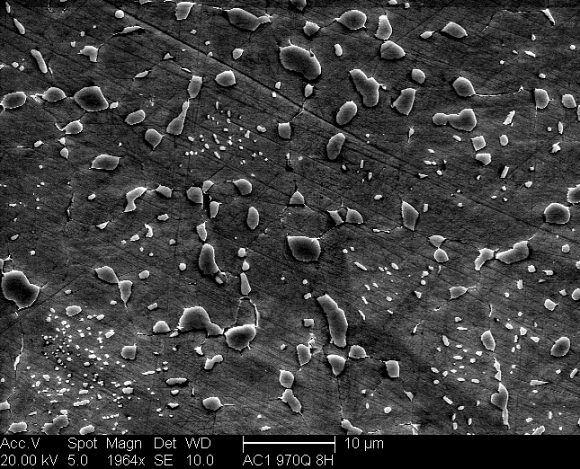

# Deep-Thresholding

Image dataset available at: https://materialsdata.nist.gov/handle/11256/940

A general dual phase steel microstructure has diffrent color intensities for different phases. This diffrence in intensities can be useful in locating the pixel position of the different phase and extracting other data such as the composition of the metal alloy whose microstructure is being considered.              
                                                                                     
                                                                                     
An example microstructure of a particular steel phase (Spherodized Cementite):

