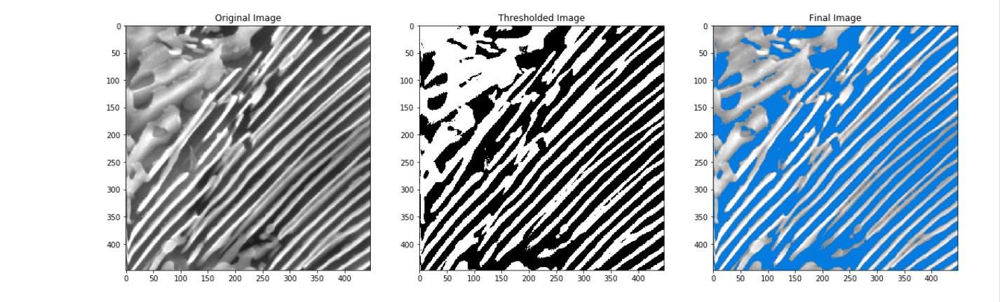

# Deep-Thresholding

Image dataset available at: https://materialsdata.nist.gov/handle/11256/940

A general dual phase steel microstructure has diffrent color intensities for different phases. This diffrence in intensities can be useful in locating the pixel position of the different phase and extracting other data such as the composition of the metal alloy whose microstructure is being considered.              
                                                                                         
The CNN takes in an image of a steel microstructure and predicts a number between 0 to 255 which is then used to do thresholding of the given grayscale image which seperates the different phases present in the image.                                                              
Side by side comparison of the original thresholded image and generated thresholded image.                           

                                                                   
Now we know the pixel position of the black portion, hence we can change the color of the pixels located in those black regions and map it to the original image to get the location of different phases in the original image.                                                                 

